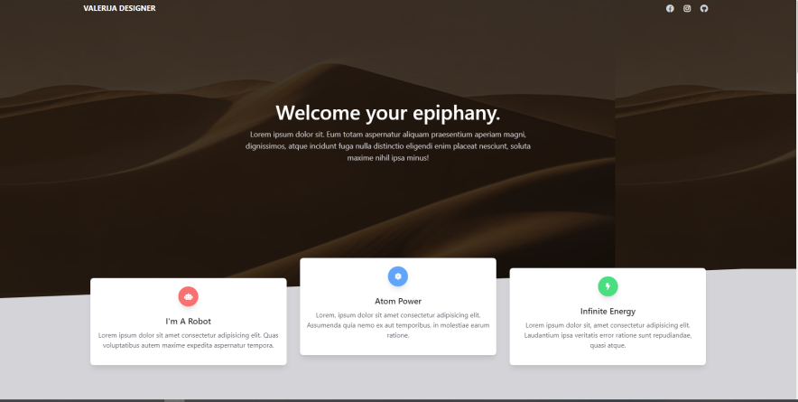

# Animated Tailwind Template

## Login

To get access to the app's content you need to run it into your browser.

## Content

Remark: Page was made out of Tailwind template page and was animated with AOS JS animations (links provided in development part of README file).

After loading page, user is set in front of first section(home).

On scrolling down, animations on page are appearing section per section. 

## Used content links
* Font Awesome: https://cdnjs.cloudflare.com/ajax/libs/font-awesome/5.10.2/css/all.min.css
* Tailwind library: https://cdn.jsdelivr.net/gh/creativetimofficial/tailwind-starter-kit/compiled-tailwind.min.css
* Images: https://unsplash.com/
* Random user API: https://randomuser.me/
* JS animations: https://michalsnik.github.io/aos/

# 👉 Built with
* HTML5
* CSS3
* JS

# 💻 Development
1. run index.html on your browser
2. git clone https://github.com/valerijadrinek/animated-tailwind-template.git
3. github pages https://valerijadrinek.github.io/animated-tailwind-template/
